---
jupyter:
  colab:
  kernelspec:
    display_name: Python 3
    name: python3
  language_info:
    name: python
  nbformat: 4
  nbformat_minor: 0
---

**Overview \[Key Energy End-use\]**

``` python
import requests
import pandas as pd
import io
import numpy as np

# Send a GET request to the API endpoint
response = requests.get('https://api.data.gov.hk/v1/historical-archive/get-file?url=https%3A%2F%2Fwww.emsd.gov.hk%2Ffilemanager%2Fen%2Fshare%2Fenergy_efficiency%2Fenergy_end_use%2F2022%2Ftable01.csv&time=20221019-1038')

# Check if the request was successful
if response.status_code == 200:
    #convert it into a file-like object
    data_io = io.StringIO(response.text)

    df_overview = pd.read_csv(data_io)
    print('Data read successfully.')
else:
    print(f'Request failed with status code {response.status_code}')
```

::: {.output .stream .stdout}
    Data read successfully.
:::
:::

::: {.cell .code execution_count="2" colab="{\"base_uri\":\"https://localhost:8080/\",\"height\":446}" id="Oe9JaKtwWizA" outputId="b916c012-3f08-4456-949e-614fe8ec498d"}
``` python
df_overview
```
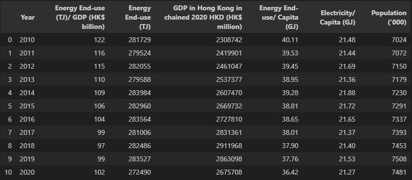

**Total Energy Consumption by fuel**

``` python
# Send a GET request to the API endpoint
response = requests.get('https://api.data.gov.hk/v1/historical-archive/get-file?url=https%3A%2F%2Fwww.emsd.gov.hk%2Ffilemanager%2Fen%2Fshare%2Fenergy_efficiency%2Fenergy_end_use%2F2022%2Ftable02.csv&time=20231007-1113')
# Check if the request was successful
if response.status_code == 200:
    #convert it into a file-like object
    data_io = io.StringIO(response.text)

    df_total_fuel = pd.read_csv(data_io)
    print('Data read successfully.')
else:
    print(f'Request failed with status code {response.status_code}')
```

::: {.output .stream .stdout}
    Data read successfully.

``` python
df_total_fuel
```
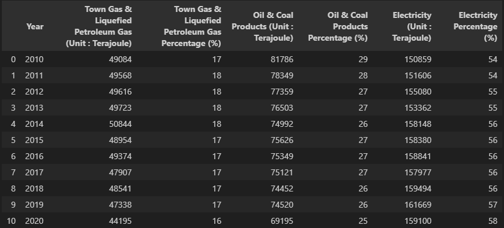


::: {.cell .markdown id="zk9r4KhSbDD_"}
**Energy Consumption in Residential Sector by Fuel**
:::

::: {.cell .code execution_count="5" colab="{\"base_uri\":\"https://localhost:8080/\"}" id="cFwJ5b1xXyXw" outputId="301d5f8c-c4a8-4cce-b4e1-14e3b129d9a9"}
``` python
# Send a GET request to the API endpoint
response = requests.get('https://api.data.gov.hk/v1/historical-archive/get-file?url=https%3A%2F%2Fwww.emsd.gov.hk%2Ffilemanager%2Fen%2Fshare%2Fenergy_efficiency%2Fenergy_end_use%2F2022%2Ftable03.csv&time=20231007-1112')
# Check if the request was successful
if response.status_code == 200:
    #convert it into a file-like object
    data_io = io.StringIO(response.text)

    df_residential_fuel = pd.read_csv(data_io)
    print('Data read successfully.')
else:
    print(f'Request failed with status code {response.status_code}')
```

::: {.output .stream .stdout}
    Data read successfully.
:::
:::

``` python
df_residential_fuel
```


**Energy Consumption in Commercial Sector by Fuel**
``` python
# Send a GET request to the API endpoint
response = requests.get('https://api.data.gov.hk/v1/historical-archive/get-file?url=https%3A%2F%2Fwww.emsd.gov.hk%2Ffilemanager%2Fen%2Fshare%2Fenergy_efficiency%2Fenergy_end_use%2F2022%2Ftable04.csv&time=20231007-1113')
# Check if the request was successful
if response.status_code == 200:
    #convert it into a file-like object
    data_io = io.StringIO(response.text)

    df_commercial_fuel = pd.read_csv(data_io)
    print('Data read successfully.')
else:
    print(f'Request failed with status code {response.status_code}')
```

::: {.output .stream .stdout}
    Data read successfully.
:::
:::

::: {.cell .code execution_count="8" colab="{\"base_uri\":\"https://localhost:8080/\",\"height\":464}" id="qhMGEywdbig-" outputId="613bd796-2182-45e1-d34f-5711a15861de"}
``` python
df_commercial_fuel
```
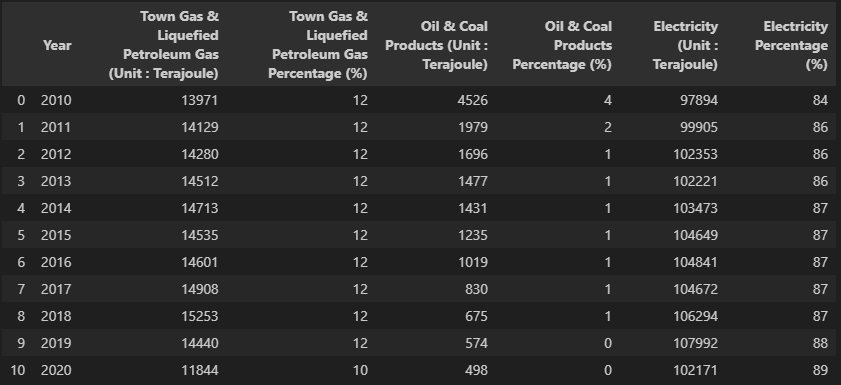

::: {.cell .markdown id="Cq7CNZgjbnz-"}
**Energy Consumption in Industrial Sector by Fuel**
:::

::: {.cell .code execution_count="9" colab="{\"base_uri\":\"https://localhost:8080/\"}" id="RL39OsFpbu_l" outputId="7ce52e24-58d2-45cc-dbed-10654df9cd17"}
``` python
# Send a GET request to the API endpoint
response = requests.get('https://api.data.gov.hk/v1/historical-archive/get-file?url=https%3A%2F%2Fwww.emsd.gov.hk%2Ffilemanager%2Fen%2Fshare%2Fenergy_efficiency%2Fenergy_end_use%2F2022%2Ftable05.csv&time=20231007-1113')
# Check if the request was successful
if response.status_code == 200:
    #convert it into a file-like object
    data_io = io.StringIO(response.text)

    df_industrial_fuel = pd.read_csv(data_io)
    print('Data read successfully.')
else:
    print(f'Request failed with status code {response.status_code}')
```

::: {.output .stream .stdout}
    Data read successfully.
:::
:::

::: {.cell .code execution_count="10" colab="{\"base_uri\":\"https://localhost:8080/\",\"height\":464}" id="WHp0AVOgb9M4" outputId="030f8864-87f4-4f6d-fb3c-d83760122be6"}
``` python
df_industrial_fuel
```
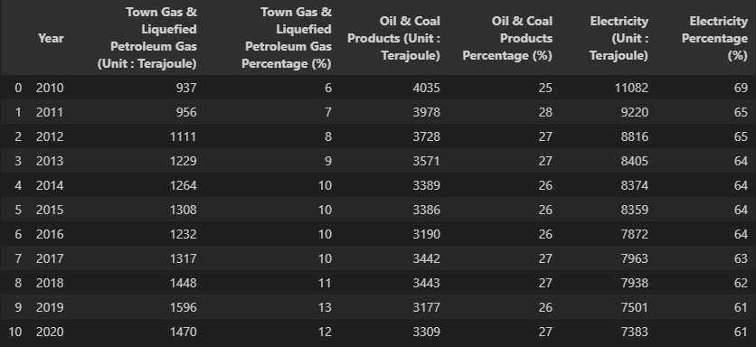

**Energy Consumption in Transport Sector by Fuel**
:::

::: {.cell .code execution_count="11" colab="{\"base_uri\":\"https://localhost:8080/\"}" id="IcnePoL8cQ3d" outputId="158315b6-3061-4ddf-dc3d-d76cecabf43f"}
``` python
# Send a GET request to the API endpoint
response = requests.get('https://api.data.gov.hk/v1/historical-archive/get-file?url=https%3A%2F%2Fwww.emsd.gov.hk%2Ffilemanager%2Fen%2Fshare%2Fenergy_efficiency%2Fenergy_end_use%2F2022%2Ftable06.csv&time=20231007-1118')
# Check if the request was successful
if response.status_code == 200:
    #convert it into a file-like object
    data_io = io.StringIO(response.text)

    df_transport_fuel = pd.read_csv(data_io)
    print('Data read successfully.')
else:
    print(f'Request failed with status code {response.status_code}')
```

::: {.output .stream .stdout}
    Data read successfully.
:::
:::

::: {.cell .code execution_count="12" colab="{\"base_uri\":\"https://localhost:8080/\",\"height\":464}" id="jZ5QoWgactxu" outputId="a5ba9727-efb1-4f32-c574-9514d196d345"}
``` python
df_transport_fuel
```


**Total Energy Consumption by Sector**
:::

::: {.cell .code execution_count="13" colab="{\"base_uri\":\"https://localhost:8080/\"}" id="MOX3BsL8c8V9" outputId="b9fb12ee-fec1-4886-b4f7-196acec67031"}
``` python
# Send a GET request to the API endpoint
response = requests.get('https://api.data.gov.hk/v1/historical-archive/get-file?url=https%3A%2F%2Fwww.emsd.gov.hk%2Ffilemanager%2Fen%2Fshare%2Fenergy_efficiency%2Fenergy_end_use%2F2022%2Ftable07.csv&time=20231007-1110')
# Check if the request was successful
if response.status_code == 200:
    #convert it into a file-like object
    data_io = io.StringIO(response.text)

    df_energy_sector = pd.read_csv(data_io)
    print('Data read successfully.')
else:
    print(f'Request failed with status code {response.status_code}')
```

::: {.output .stream .stdout}
    Data read successfully.
:::
:::

::: {.cell .code execution_count="14" colab="{\"base_uri\":\"https://localhost:8080/\",\"height\":449}" id="oHku9q38dfnJ" outputId="d9fee852-9e94-401a-9772-a1db11fa4730"}
``` python
df_energy_sector
```
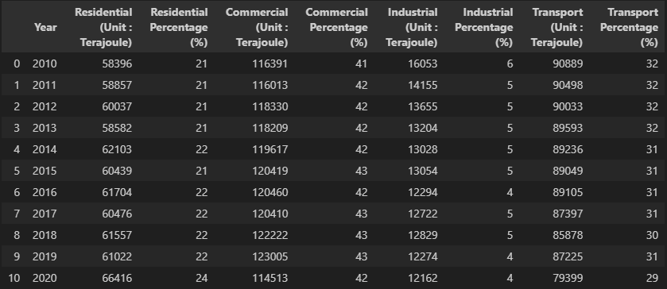

**Electricity Consumption by Sector**
:::

::: {.cell .code execution_count="15" colab="{\"base_uri\":\"https://localhost:8080/\"}" id="SpHbF6HXeHxA" outputId="68f8acb0-20fd-4074-be92-695b0e24bdd3"}
``` python
# Send a GET request to the API endpoint
response = requests.get('https://www.emsd.gov.hk/filemanager/en/share/energy_efficiency/energy_end_use/2022/table08.csv')
# Check if the request was successful
if response.status_code == 200:
    #convert it into a file-like object
    data_io = io.StringIO(response.text)

    df_electricity_sector = pd.read_csv(data_io)
    print('Data read successfully.')
else:
    print(f'Request failed with status code {response.status_code}')
```

::: {.output .stream .stdout}
    Data read successfully.
:::
:::

::: {.cell .code execution_count="16" colab="{\"base_uri\":\"https://localhost:8080/\",\"height\":449}" id="AX3KoCIpeW_f" outputId="12280e7c-7328-4d9c-d0c9-020bb8b14361"}
``` python
df_electricity_sector
```
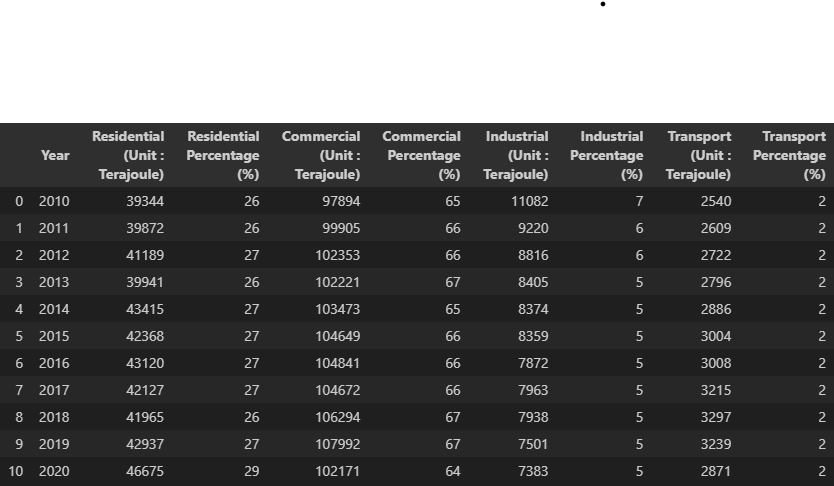

**Oil & Coal Products Consumption by Sector**
:::

::: {.cell .code execution_count="17" colab="{\"base_uri\":\"https://localhost:8080/\"}" id="OmNOfSlNfnvE" outputId="18212ff3-1aad-438b-ad80-47a039695336"}
``` python
# Send a GET request to the API endpoint
response = requests.get('https://www.emsd.gov.hk/filemanager/en/share/energy_efficiency/energy_end_use/2022/table09.csv')
# Check if the request was successful
if response.status_code == 200:
    #convert it into a file-like object
    data_io = io.StringIO(response.text)

    df_oilcoal_sector = pd.read_csv(data_io)
    print('Data read successfully.')
else:
    print(f'Request failed with status code {response.status_code}')
```

::: {.output .stream .stdout}
    Data read successfully.
:::
:::

::: {.cell .code execution_count="18" colab="{\"base_uri\":\"https://localhost:8080/\",\"height\":449}" id="m27XOACZiIVs" outputId="054d3ec3-bde8-4ee3-f173-61e9769c4c9f"}
``` python
df_oilcoal_sector
```

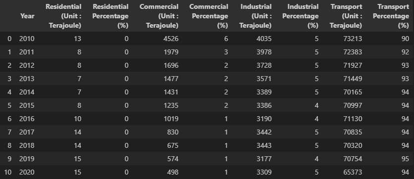

**Town Gas & LPG Consumption by Sector**
:::

::: {.cell .code execution_count="19" colab="{\"base_uri\":\"https://localhost:8080/\"}" id="vgiU8WHmfonI" outputId="5b1da677-bce3-469a-ecde-537b0a1dd193"}
``` python
# Send a GET request to the API endpoint
response = requests.get('https://www.emsd.gov.hk/filemanager/en/share/energy_efficiency/energy_end_use/2022/table10.csv')
# Check if the request was successful
if response.status_code == 200:
    #convert it into a file-like object
    data_io = io.StringIO(response.text)

    df_gaslpg_sector = pd.read_csv(data_io)
    print('Data read successfully.')
else:
    print(f'Request failed with status code {response.status_code}')
```

::: {.output .stream .stdout}
    Data read successfully.
:::
:::

::: {.cell .code execution_count="20" colab="{\"base_uri\":\"https://localhost:8080/\",\"height\":449}" id="DaXxkCQmiKaU" outputId="04661e59-dc7d-40ba-defb-68c618b102f8"}
``` python
df_gaslpg_sector
```

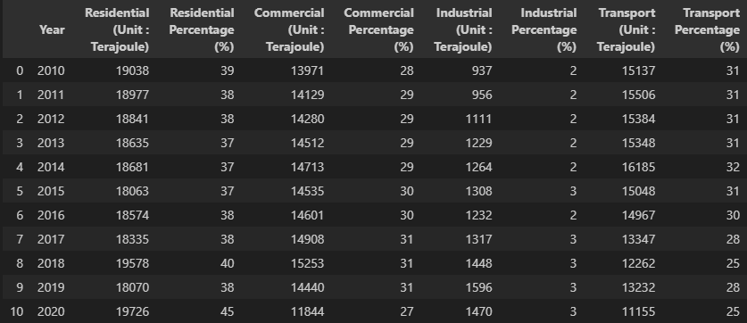

**Total Energy Consumption by End-use**
:::

::: {.cell .code execution_count="21" colab="{\"base_uri\":\"https://localhost:8080/\"}" id="pMwdqEZYfpZk" outputId="715f0b63-1bb1-4bc9-b387-4db79624bd8d"}
``` python
# Send a GET request to the API endpoint
response = requests.get('https://www.emsd.gov.hk/filemanager/en/share/energy_efficiency/energy_end_use/2022/table11.csv')
# Check if the request was successful
if response.status_code == 200:
    #convert it into a file-like object
    data_io = io.StringIO(response.text)

    df_energy_enduse = pd.read_csv(data_io)
    print('Data read successfully.')
else:
    print(f'Request failed with status code {response.status_code}')
```

::: {.output .stream .stdout}
    Data read successfully.
:::
:::

::: {.cell .code execution_count="22" colab="{\"base_uri\":\"https://localhost:8080/\",\"height\":513}" id="fJGHjDr-iM3B" outputId="0c98b8ab-d837-4b1f-f1fa-1c9ee13cb423"}
``` python
df_energy_enduse
```

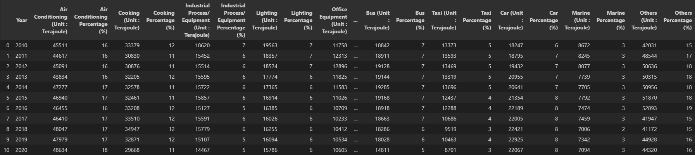

**Electricity Consumption by End-use**
:::

::: {.cell .code execution_count="23" colab="{\"base_uri\":\"https://localhost:8080/\"}" id="ReCtu-IXfpSU" outputId="88f2f566-6f86-4404-f3cd-3f5958ccff95"}
``` python
# Send a GET request to the API endpoint
response = requests.get('https://www.emsd.gov.hk/filemanager/en/share/energy_efficiency/energy_end_use/2022/table12.csv')
# Check if the request was successful
if response.status_code == 200:
    #convert it into a file-like object
    data_io = io.StringIO(response.text)

    df_electricity_enduse = pd.read_csv(data_io)
    print('Data read successfully.')
else:
    print(f'Request failed with status code {response.status_code}')
```

::: {.output .stream .stdout}
    Data read successfully.
:::
:::

::: {.cell .code execution_count="24" colab="{\"base_uri\":\"https://localhost:8080/\",\"height\":484}" id="mIqXu3wXiO5z" outputId="6b15f0a2-d476-4dea-9bb6-27b6dec33739"}
``` python
df_electricity_enduse
```

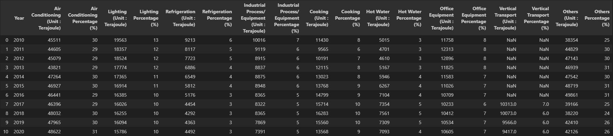

**Oil & Coal Products Consumption by End-use**
:::

::: {.cell .code execution_count="25" colab="{\"base_uri\":\"https://localhost:8080/\"}" id="egZDZ0qogNvO" outputId="8b5252e1-1863-48f2-9de7-e8b3d165038c"}
``` python
# Send a GET request to the API endpoint
response = requests.get('https://www.emsd.gov.hk/filemanager/en/share/energy_efficiency/energy_end_use/2022/table13.csv')
# Check if the request was successful
if response.status_code == 200:
    #convert it into a file-like object
    data_io = io.StringIO(response.text)

    df_oilcoal_enduse = pd.read_csv(data_io)
    print('Data read successfully.')
else:
    print(f'Request failed with status code {response.status_code}')
```

::: {.output .stream .stdout}
    Data read successfully.
:::
:::

::: {.cell .code execution_count="26" colab="{\"base_uri\":\"https://localhost:8080/\",\"height\":484}" id="g3JKRqf4iYpw" outputId="fe44fd1f-dafc-4709-ccf1-ff99ef4a027f"}
``` python
df_oilcoal_enduse
```

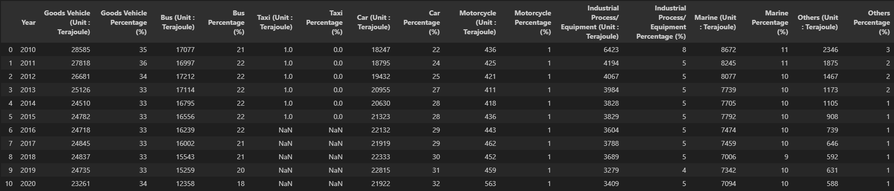

**Town Gas & Liquefied Petroleum Gas Consumption by End-use**
:::

::: {.cell .code execution_count="27" colab="{\"base_uri\":\"https://localhost:8080/\"}" id="VP35eXXZgYD5" outputId="68965cf7-76df-468e-e087-f094fc986f6f"}
``` python
# Send a GET request to the API endpoint
response = requests.get('https://www.emsd.gov.hk/filemanager/en/share/energy_efficiency/energy_end_use/2022/table14.csv')
# Check if the request was successful
if response.status_code == 200:
    #convert it into a file-like object
    data_io = io.StringIO(response.text)

    df_gaslpg_enduse = pd.read_csv(data_io)
    print('Data read successfully.')
else:
    print(f'Request failed with status code {response.status_code}')
```

::: {.output .stream .stdout}
    Data read successfully.
:::
:::

::: {.cell .code execution_count="28" colab="{\"base_uri\":\"https://localhost:8080/\",\"height\":449}" id="Bhw2JyvbiadJ" outputId="42b24bb7-1d65-47b8-8b60-0be862c3480f"}
``` python
df_gaslpg_enduse
```

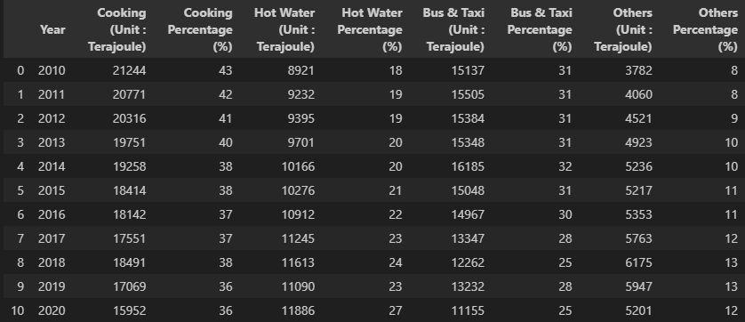

Type of Renewable Energy in Hong Kong
:::

::: {.cell .code execution_count="29" colab="{\"base_uri\":\"https://localhost:8080/\"}" id="xS1IJtH0ggn7" outputId="f51dac6e-f892-4ab9-c002-4f993f5ea076"}
``` python
# Send a GET request to the API endpoint
response = requests.get('https://www.emsd.gov.hk/filemanager/en/share/energy_efficiency/energy_end_use/2022/table15.csv')
# Check if the request was successful
if response.status_code == 200:
    #convert it into a file-like object
    data_io = io.StringIO(response.text)

    df_energy_renewable = pd.read_csv(data_io)
    print('Data read successfully.')
else:
    print(f'Request failed with status code {response.status_code}')
```

::: {.output .stream .stdout}
    Data read successfully.
:::
:::

::: {.cell .code execution_count="30" colab="{\"base_uri\":\"https://localhost:8080/\",\"height\":192}" id="RVBsYpLEic1E" outputId="123e983f-10a3-4195-b3b6-c91c11efb813"}
``` python
df_energy_renewable
```

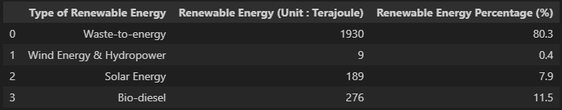

**Type of Renewable Energy in Hong Kong by Fuel**
:::

::: {.cell .code execution_count="31" colab="{\"base_uri\":\"https://localhost:8080/\"}" id="P9NJHKC7gmgG" outputId="e0bca0b5-7f74-43df-ee19-c2f1cfad86b1"}
``` python
# Send a GET request to the API endpoint
response = requests.get('https://www.emsd.gov.hk/filemanager/en/share/energy_efficiency/energy_end_use/2022/table16.csv')
# Check if the request was successful
if response.status_code == 200:
    #convert it into a file-like object
    data_io = io.StringIO(response.text)

    df_energy_renewable_fuel = pd.read_csv(data_io)
    print('Data read successfully.')
else:
    print(f'Request failed with status code {response.status_code}')
```

::: {.output .stream .stdout}
    Data read successfully.
:::
:::

::: {.cell .code execution_count="32" colab="{\"base_uri\":\"https://localhost:8080/\",\"height\":230}" id="i0HMiKjAif7I" outputId="67bfb3e4-8e91-4908-ff2a-d324cb093029"}
``` python
df_energy_renewable_fuel
```

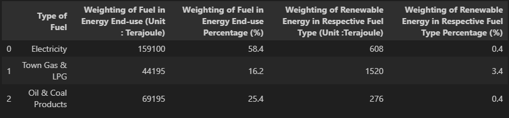

``` python
dataframes = [df_overview, df_total_fuel, df_residential_fuel, df_commercial_fuel, df_industrial_fuel,
              df_transport_fuel, df_energy_sector, df_electricity_sector, df_oilcoal_sector,
              df_gaslpg_sector, df_energy_enduse, df_electricity_enduse, df_oilcoal_enduse,
              df_gaslpg_enduse, df_energy_renewable, df_energy_renewable_fuel]
```
:::

::: {.cell .code execution_count="34" colab="{\"base_uri\":\"https://localhost:8080/\"}" id="l_6AkCIux7b5" outputId="f3418c2d-85d3-4fe3-96a2-06ac2bde1926"}
``` python
for df in dataframes:
    print(df.shape)
```

::: {.output .stream .stdout}
    (11, 7)
    (11, 7)
    (11, 7)
    (11, 7)
    (11, 7)
    (11, 7)
    (11, 9)
    (11, 9)
    (11, 9)
    (11, 9)
    (11, 29)
    (11, 19)
    (11, 17)
    (11, 9)
    (4, 3)
    (3, 5)
:::

``` python
for df in dataframes:
    print(df.isnull().sum())
```

::: {.output .stream .stdout}
    Year                                                  0
    Energy End-use (TJ)/ GDP (HK$ billion)                0
    Energy End-use (TJ)                                   0
    GDP in Hong Kong in chained 2020 HKD (HK$ million)    0
    Energy End-use/ Capita (GJ)                           0
    Electricity/ Capita (GJ)                              0
    Population ('000)                                     0
    dtype: int64
    Year                                                     0
    Town Gas & Liquefied Petroleum Gas (Unit : Terajoule)    0
    Town Gas & Liquefied Petroleum Gas Percentage (%)        0
    Oil & Coal Products (Unit : Terajoule)                   0
    Oil & Coal Products Percentage (%)                       0
    Electricity (Unit : Terajoule)                           0
    Electricity Percentage (%)                               0
    dtype: int64
    Year                                                     0
    Town Gas & Liquefied Petroleum Gas (Unit : Terajoule)    0
    Town Gas & Liquefied Petroleum Gas Percentage (%)        0
    Oil & Coal Products (Unit : Terajoule)                   0
    Oil & Coal Products Percentage (%)                       0
    Electricity (Unit : Terajoule)                           0
    Electricity Percentage (%)                               0
    dtype: int64
    Year                                                     0
    Town Gas & Liquefied Petroleum Gas (Unit : Terajoule)    0
    Town Gas & Liquefied Petroleum Gas Percentage (%)        0
    Oil & Coal Products (Unit : Terajoule)                   0
    Oil & Coal Products Percentage (%)                       0
    Electricity (Unit : Terajoule)                           0
    Electricity Percentage (%)                               0
    dtype: int64
    Year                                                     0
    Town Gas & Liquefied Petroleum Gas (Unit : Terajoule)    0
    Town Gas & Liquefied Petroleum Gas Percentage (%)        0
    Oil & Coal Products (Unit : Terajoule)                   0
    Oil & Coal Products Percentage (%)                       0
    Electricity (Unit : Terajoule)                           0
    Electricity Percentage (%)                               0
    dtype: int64
    Year                                                     0
    Town Gas & Liquefied Petroleum Gas (Unit : Terajoule)    0
    Town Gas & Liquefied Petroleum Gas Percentage (%)        0
    Oil & Coal Products (Unit : Terajoule)                   0
    Oil & Coal Products Percentage (%)                       0
    Electricity (Unit : Terajoule)                           0
    Electricity Percentage (%)                               0
    dtype: int64
    Year                              0
    Residential (Unit : Terajoule)    0
    Residential Percentage (%)        0
    Commercial (Unit : Terajoule)     0
    Commercial Percentage (%)         0
    Industrial (Unit : Terajoule)     0
    Industrial Percentage (%)         0
    Transport (Unit : Terajoule)      0
    Transport Percentage (%)          0
    dtype: int64
    Year                              0
    Residential (Unit : Terajoule)    0
    Residential Percentage (%)        0
    Commercial (Unit : Terajoule)     0
    Commercial Percentage (%)         0
    Industrial (Unit : Terajoule)     0
    Industrial Percentage (%)         0
    Transport (Unit : Terajoule)      0
    Transport Percentage (%)          0
    dtype: int64
    Year                              0
    Residential (Unit : Terajoule)    0
    Residential Percentage (%)        0
    Commercial (Unit : Terajoule)     0
    Commercial Percentage (%)         0
    Industrial (Unit : Terajoule)     0
    Industrial Percentage (%)         0
    Transport (Unit : Terajoule)      0
    Transport Percentage (%)          0
    dtype: int64
    Year                              0
    Residential (Unit : Terajoule)    0
    Residential Percentage (%)        0
    Commercial (Unit : Terajoule)     0
    Commercial Percentage (%)         0
    Industrial (Unit : Terajoule)     0
    Industrial Percentage (%)         0
    Transport (Unit : Terajoule)      0
    Transport Percentage (%)          0
    dtype: int64
    Year                                                0
    Air Conditioning (Unit : Terajoule)                 0
    Air Conditioning Percentage (%)                     0
    Cooking (Unit : Terajoule)                          0
    Cooking Percentage (%)                              0
    Industrial Process/ Equipment (Unit : Terajoule)    0
    Industrial Process/ Equipment Percentage (%)        0
    Lighting (Unit : Terajoule)                         0
    Lighting Percentage (%)                             0
    Office Equipment (Unit : Terajoule)                 0
    Office Equipment Percentage (%)                     0
    Refrigeration (Unit : Terajoule)                    0
    Refrigeration Percentage (%)                        0
    Hot Water (Unit : Terajoule)                        0
    Hot Water Percentage (%)                            0
    Vertical Transport (Unit : Terajoule)               7
    Vertical Transport Percentage (%)                   7
    Goods Vehicle (Unit : Terajoule)                    0
    Goods Vehicle Percentage (%)                        0
    Bus (Unit : Terajoule)                              0
    Bus Percentage (%)                                  0
    Taxi (Unit : Terajoule)                             0
    Taxi Percentage (%)                                 0
    Car (Unit : Terajoule)                              0
    Car Percentage (%)                                  0
    Marine (Unit : Terajoule)                           0
    Marine Percentage (%)                               0
    Others (Unit : Terajoule)                           0
    Others Percentage (%)                               0
    dtype: int64
    Year                                                0
    Air Conditioning (Unit : Terajoule)                 0
    Air Conditioning Percentage (%)                     0
    Lighting (Unit : Terajoule)                         0
    Lighting Percentage (%)                             0
    Refrigeration (Unit : Terajoule)                    0
    Refrigeration Percentage (%)                        0
    Industrial Process/ Equipment (Unit : Terajoule)    0
    Industrial Process/ Equipment Percentage (%)        0
    Cooking (Unit : Terajoule)                          0
    Cooking Percentage (%)                              0
    Hot Water (Unit : Terajoule)                        0
    Hot Water Percentage (%)                            0
    Office Equipment (Unit : Terajoule)                 0
    Office Equipment Percentage (%)                     0
    Vertical Transport (Unit : Terajoule)               7
    Vertical Transport Percentage (%)                   7
    Others (Unit : Terajoule)                           0
    Others Percentage (%)                               0
    dtype: int64
    Year                                                0
    Goods Vehicle (Unit : Terajoule)                    0
    Goods Vehicle Percentage (%)                        0
    Bus (Unit : Terajoule)                              0
    Bus Percentage (%)                                  0
    Taxi (Unit : Terajoule)                             5
    Taxi Percentage (%)                                 5
    Car (Unit : Terajoule)                              0
    Car Percentage (%)                                  0
    Motorcycle (Unit : Terajoule)                       0
    Motorcycle Percentage (%)                           0
    Industrial Process/ Equipment (Unit : Terajoule)    0
    Industrial Process/ Equipment Percentage (%)        0
    Marine (Unit : Terajoule)                           0
    Marine Percentage (%)                               0
    Others (Unit : Terajoule)                           0
    Others Percentage (%)                               0
    dtype: int64
    Year                             0
    Cooking (Unit : Terajoule)       0
    Cooking Percentage (%)           0
    Hot Water (Unit : Terajoule)     0
    Hot Water Percentage (%)         0
    Bus & Taxi (Unit : Terajoule)    0
    Bus & Taxi Percentage (%)        0
    Others (Unit : Terajoule)        0
    Others Percentage (%)            0
    dtype: int64
    Type of Renewable Energy               0
    Renewable Energy (Unit : Terajoule)    0
    Renewable Energy Percentage (%)        0
    dtype: int64
    Type of Fuel                                                               0
    Weighting of Fuel in Energy End-use (Unit : Terajoule)                     0
    Weighting of Fuel in Energy End-use Percentage (%)                         0
    Weighting of Renewable Energy in Respective Fuel Type (Unit :Terajoule)    0
    Weighting of Renewable Energy in Respective Fuel Type Percentage (%)       0
    dtype: int64
:::
:::

::: {.cell .code execution_count="36" colab="{\"base_uri\":\"https://localhost:8080/\",\"height\":542}" id="L2UXxF7CyCKC" outputId="63361af0-a0e7-4a94-b278-60a48f5d651a"}
``` python
import plotly.express as px
import plotly.graph_objects as go
import plotly.figure_factory as ff

# Heatmap
df_corr = df_overview.corr()
fig = go.Figure(data=go.Heatmap(z=df_corr.values.tolist(), x=df_corr.columns.tolist(), y=df_corr.columns.tolist()))
fig.show()
```
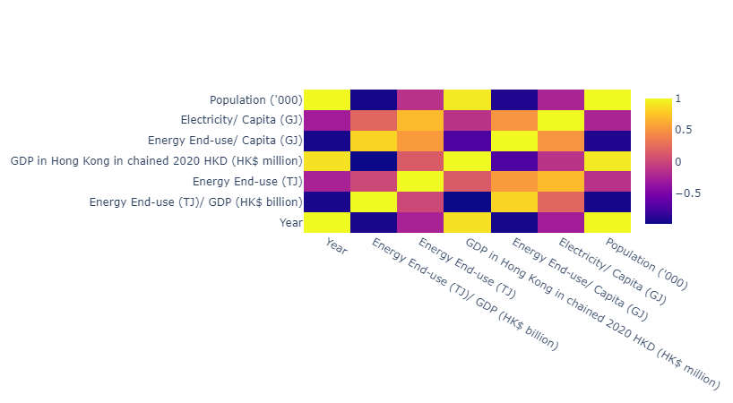

``` python
# Line plot for 'Trend of Energy End-use over the Years'
fig = px.line(df_overview, x='Year', y='Energy End-use (TJ)', title='Trend of Energy End-use over the Years')
fig.show()
```
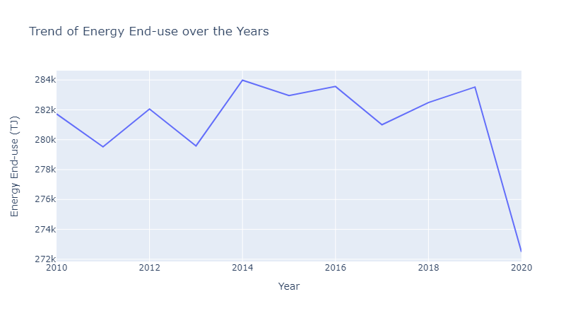

``` python
from sklearn.model_selection import train_test_split
from sklearn.linear_model import LinearRegression

X = df_overview.drop('Energy End-use (TJ)', axis=1)
y = df_overview['Energy End-use (TJ)']

X_train, X_test, y_train, y_test = train_test_split(X, y, test_size=0.2, random_state=42)

model = LinearRegression()
model.fit(X_train, y_train)

predictions = model.predict(X_test)
```
:::

``` python
print(predictions)
```

::: {.output .stream .stdout}
    [282930.20184256 281933.44935531 283681.35070016]
:::
:::


``` python
from sklearn.metrics import mean_absolute_error, mean_squared_error

print("MAE: ", mean_absolute_error(y_test, predictions))
print("MSE: ", mean_squared_error(y_test, predictions))
print("RMSE: ", np.sqrt(mean_squared_error(y_test, predictions)))
```

::: {.output .stream .stdout}
    MAE:  129.532737636182
    MSE:  22170.535904252512
    RMSE:  148.89773639734256
:::
:::


``` python
# Line plot for 'Trend of Energy End-use and GDP over the Years'
fig = go.Figure()
fig.add_trace(go.Scatter(x=df_overview['Year'], y=df_overview['Energy End-use (TJ)'], mode='lines', name='Energy End-use'))
fig.add_trace(go.Scatter(x=df_overview['Year'], y=df_overview['GDP in Hong Kong in chained 2020 HKD (HK$ million)'], mode='lines', name='GDP'))
fig.show()
```
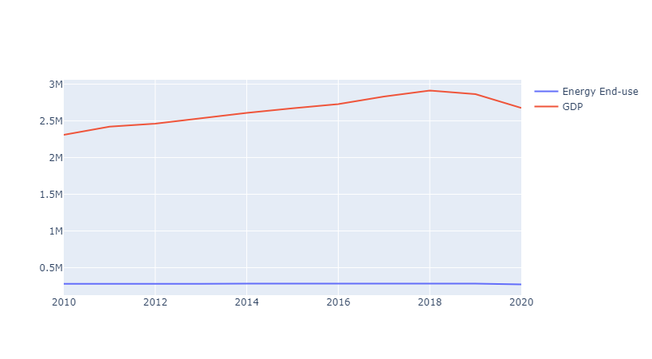

``` python
# Grouped bar plot for 'Proportion of Different Fuels Used in Residential Sector Over the Years'
df_melted = pd.melt(df_residential_fuel, id_vars='Year', value_vars=['Town Gas & Liquefied Petroleum Gas (Unit : Terajoule)', 'Oil & Coal Products (Unit : Terajoule)', 'Electricity (Unit : Terajoule)'])
fig = px.bar(df_melted, x='Year', y='value', color='variable', title='Proportion of Different Fuels Used in Residential Sector Over the Years', labels={'value':'Energy Consumption (TJ)', 'variable':'Fuel Type'})
fig.show()
```
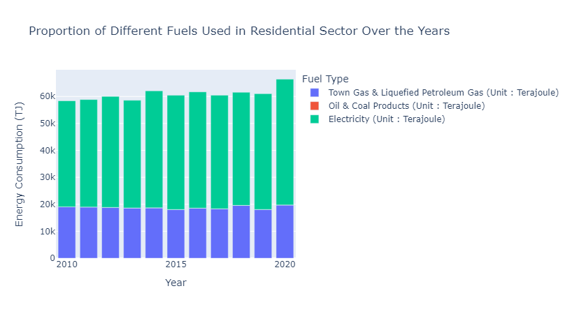

``` python
# Line plot for 'Energy Consumption by Sector'
fig = go.Figure()
fig.add_trace(go.Scatter(x=df_energy_sector['Year'], y=df_energy_sector['Residential (Unit : Terajoule)'], mode='lines', name='Residential'))
fig.add_trace(go.Scatter(x=df_energy_sector['Year'], y=df_energy_sector['Commercial (Unit : Terajoule)'], mode='lines', name='Commercial'))
fig.add_trace(go.Scatter(x=df_energy_sector['Year'], y=df_energy_sector['Industrial (Unit : Terajoule)'], mode='lines', name='Industrial'))
fig.add_trace(go.Scatter(x=df_energy_sector['Year'], y=df_energy_sector['Transport (Unit : Terajoule)'], mode='lines', name='Transport'))
fig.update_layout(title='Energy Consumption by Sector', xaxis_title='Year', yaxis_title='Energy Consumption (TJ)')
fig.show()
```
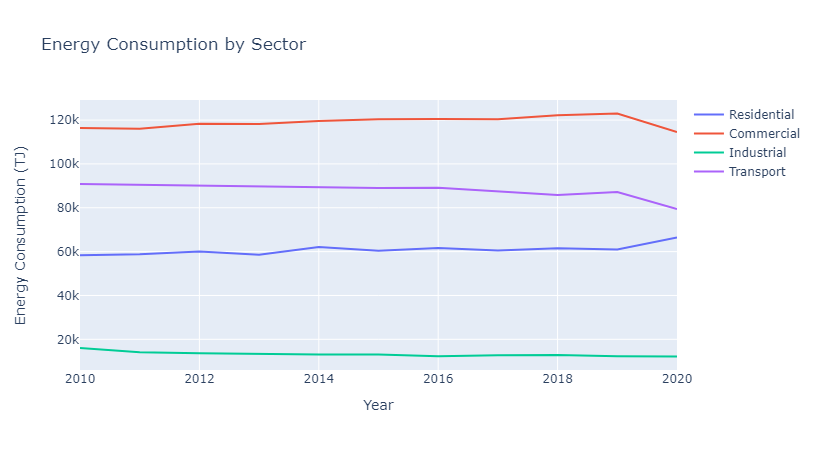

``` python
# Line plot for 'Electricity Consumption by End-use'
fig = go.Figure()
fig.add_trace(go.Scatter(x=df_electricity_enduse['Year'], y=df_electricity_enduse['Air Conditioning (Unit : Terajoule)'], mode='lines', name='Air Conditioning'))
fig.add_trace(go.Scatter(x=df_electricity_enduse['Year'], y=df_electricity_enduse['Lighting (Unit : Terajoule)'], mode='lines', name='Lighting'))
fig.add_trace(go.Scatter(x=df_electricity_enduse['Year'], y=df_electricity_enduse['Refrigeration (Unit : Terajoule)'], mode='lines', name='Refrigeration'))
fig.update_layout(title='Electricity Consumption by End-use', xaxis_title='Year', yaxis_title='Electricity Consumption (TJ)')
fig.show()
```
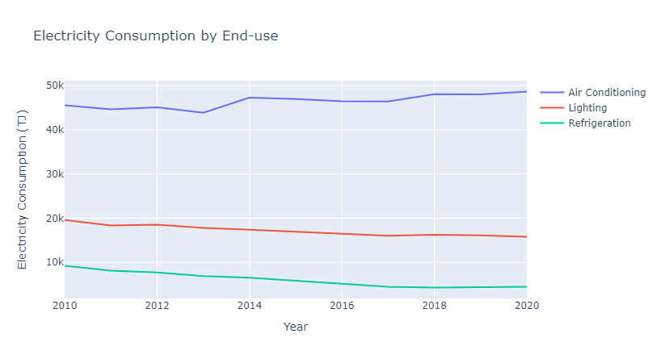

``` python
# Pie chart for 'Proportion of Different Types of Renewable Energy'
fig = go.Figure(data=[go.Pie(labels=df_energy_renewable['Type of Renewable Energy'].values, values=df_energy_renewable['Renewable Energy (Unit : Terajoule)'].values)])
fig.update_layout(title_text='Proportion of Different Types of Renewable Energy')
fig.show()
```
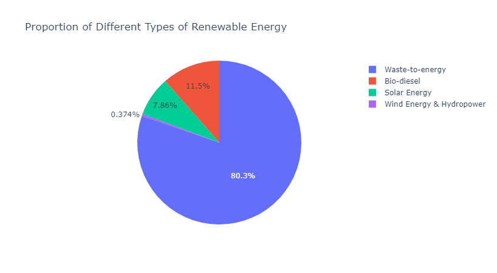


