---
jupyter:
  colab:
  kernelspec:
    display_name: Python 3
    name: python3
  language_info:
    name: python
  nbformat: 4
  nbformat_minor: 0
---


**Import libraries**


``` python
# Import necessary libraries
import yfinance as yf
import pandas as pd
import numpy as np
from sklearn.model_selection import train_test_split
from sklearn.linear_model import LinearRegression
from sklearn.tree import DecisionTreeRegressor
from sklearn.ensemble import RandomForestRegressor
from sklearn.preprocessing import StandardScaler
from sklearn.decomposition import PCA
import matplotlib.pyplot as plt
from datetime import timedelta
import seaborn as sns
from statsmodels.tsa.seasonal import seasonal_decompose
```


**Define the tickers**

``` python
# Define the stocks to be fetched
symbols = ['AAPL', 'MSFT', 'GOOGL', 'META', 'JFU']

# Fetch stock data from Yahoo Finance
data = yf.download(symbols,'2020-01-01','2023-09-01')
```

``` python
print(data.head())
```
:::
                Adj Close                                                Close  \
                     AAPL      GOOGL    JFU        META        MSFT       AAPL   
    Date                                                                         
    2020-01-02  73.249023  68.433998  190.0  209.779999  155.093674  75.087502   
    2020-01-03  72.536896  68.075996  190.0  208.669998  153.162460  74.357498   
    2020-01-06  73.114883  69.890503  190.0  212.600006  153.558380  74.949997   
    2020-01-07  72.771034  69.755501  190.0  213.059998  152.158279  74.597504   
    2020-01-08  73.941658  70.251999  187.0  215.220001  154.581924  75.797501   

   :                                                       ...       Open  \
                    GOOGL    JFU        META        MSFT  ...       AAPL   
    Date                                                  ...              
    2020-01-02  68.433998  190.0  209.779999  160.619995  ...  74.059998   
    2020-01-03  68.075996  190.0  208.669998  158.619995  ...  74.287498   
    2020-01-06  69.890503  190.0  212.600006  159.029999  ...  73.447502   
    2020-01-07  69.755501  190.0  213.059998  157.580002  ...  74.959999   
    2020-01-08  70.251999  187.0  215.220001  160.089996  ...  74.290001   

   :                                                               Volume  \
                    GOOGL         JFU        META        MSFT       AAPL   
    Date                                                                   
    2020-01-02  67.420502  187.000000  206.750000  158.779999  135480400   
    2020-01-03  67.400002  182.199997  207.210007  158.320007  146322800   
    2020-01-06  67.581497  184.199997  206.699997  157.080002  118387200   
    2020-01-07  70.023003  196.199997  212.820007  159.320007  108872000   
    2020-01-08  69.740997  186.059998  213.000000  158.929993  132079200   

   :                                                  
                 GOOGL   JFU      META      MSFT  
    Date                                            
    2020-01-02  27278000  2780  12077100  22622100  
    2020-01-03  23408000    30  11188400  21116200  
    2020-01-06  46768000   225  17058900  20813700  
    2020-01-07  34330000  4465  14912400  21634100  
    2020-01-08  35314000   520  13475000  27746500  
   :
    [5 rows x 30 columns]
    
**Moving averages and Relative Strength Index**

``` python
# Calculate moving averages and RSI for each stock symbol
for symbol in symbols:
    # Calculate 14-day RSI
    delta = data['Close'][symbol].diff()
    up, down = delta.copy(), delta.copy()
    up[up < 0] = 0
    down[down > 0] = 0
    average_gain = up.rolling(window=14).mean()
    average_loss = abs(down.rolling(window=14).mean())
    rs = average_gain / average_loss
    data[symbol+'_RSI'] = 100 - (100 / (1 + rs))

    # Calculate 50-day moving average
    data[symbol+'_MA50'] = data['Close'][symbol].rolling(window=50).mean()

    # Calculate 200-day moving average
    data[symbol+'_MA200'] = data['Close'][symbol].rolling(window=200).mean()
```

``` python
# Predict for the next 'n' days using linear regression, decision tree regressor, and random forest regressor
forecast_out = 30

# Create another column shifted 'n' units up for each stock symbol
for symbol in symbols:
    data[symbol+'_Prediction'] = data['Close'][symbol].shift(-forecast_out)
```

**Training Models**

``` python
# Create the independent and dependent data sets for each stock symbol and train models
for symbol in symbols:
    X = np.array(data.drop([symbol+'_Prediction'], 1))[:-forecast_out]
    y = np.array(data[symbol+'_Prediction'].dropna())

    # Split the data into 80% training and 20% testing
    x_train, x_test, y_train, y_test = train_test_split(X, y, test_size=0.2)

    # Standardize the features for better performance using StandardScaler
    scaler = StandardScaler()
    x_train_scaled = scaler.fit_transform(x_train)
    x_test_scaled = scaler.transform(x_test)

    # Fill NaN values with 0 because PCA contains NaN values, which causes errors
    x_train_scaled = np.nan_to_num(x_train_scaled)
    x_test_scaled = np.nan_to_num(x_test_scaled)

    # Apply PCA for dimensionality reduction
    #https://www.geeksforgeeks.org/dimensionality-reduction/
    pca = PCA(n_components=2)
    x_train_pca = pca.fit_transform(x_train_scaled)
    x_test_pca = pca.transform(x_test_scaled)

    #Linear Regression Model w/ PCA transformed data
    lr = LinearRegression()
    lr.fit(x_train_pca, y_train)

    #Decision Tree Regressor Model w/ and PCA transformed data
    tree = DecisionTreeRegressor()
    tree.fit(x_train_pca, y_train)

    #Random Forest Regressor Model w/ PCA transformed data
    forest = RandomForestRegressor()
    forest.fit(x_train_pca, y_train)

    #Test the models
    lr_confidence = lr.score(x_test_pca, y_test)
    tree_confidence = tree.score(x_test_pca, y_test)
    forest_confidence = forest.score(x_test_pca, y_test)

    print(symbol + " Linear Regression Confidence: ", lr_confidence)
    print(symbol + " Decision Tree Confidence: ", tree_confidence)
    print(symbol + " Random Forest Confidence: ", forest_confidence)


#.iloc is not working
```
:
    AAPL Linear Regression Confidence:  0.8693749526815797
    AAPL Decision Tree Confidence:  0.9081605516537108
    AAPL Random Forest Confidence:  0.9468460793945255
:
    MSFT Linear Regression Confidence:  0.8035098620081532
    MSFT Decision Tree Confidence:  0.8417873573839362
    MSFT Random Forest Confidence:  0.9058770578190273
:
    GOOGL Linear Regression Confidence:  0.8837169010119778
    GOOGL Decision Tree Confidence:  0.9285290838698419
    GOOGL Random Forest Confidence:  0.9503598628042024
:
    META Linear Regression Confidence:  0.7496966470619988
    META Decision Tree Confidence:  0.8259379697861178
    META Random Forest Confidence:  0.888153590092148
:
    JFU Linear Regression Confidence:  0.6217064867191909
    JFU Decision Tree Confidence:  0.9017686032831084
    JFU Random Forest Confidence:  0.8934490293521452

**Correlation**

``` python
# Correlation Analysis
correlation_matrix = data.corr()
print("Correlation Matrix:")
print(correlation_matrix)
```

    Correlation Matrix:
                           Adj Close                                          \
                                AAPL     GOOGL       JFU      META      MSFT   
    Adj Close        AAPL   1.000000  0.808847 -0.812810  0.181220  0.934111   
                     GOOGL  0.808847  1.000000 -0.555156  0.504299  0.910637   
                     JFU   -0.812810 -0.555156  1.000000 -0.074040 -0.683986   
                     META   0.181220  0.504299 -0.074040  1.000000  0.389772   
                     MSFT   0.934111  0.910637 -0.683986  0.389772  1.000000   
    Close            AAPL   0.999870  0.813587 -0.813391  0.191361  0.934948   
                     GOOGL  0.808847  1.000000 -0.555156  0.504299  0.910637   
                     JFU   -0.812810 -0.555156  1.000000 -0.074040 -0.683986   
                     META   0.181220  0.504299 -0.074040  1.000000  0.389772   
                     MSFT   0.927045  0.918937 -0.676471  0.412579  0.999452   
    High             AAPL   0.998769  0.810231 -0.816160  0.184809  0.930935   
                     GOOGL  0.811826  0.998975 -0.558605  0.494979  0.910685   
                     JFU   -0.817450 -0.558369  0.997951 -0.070261 -0.687734   
                     META   0.183317  0.505509 -0.076865  0.999045  0.391049   
                     MSFT   0.928521  0.916743 -0.677260  0.404177  0.998250   
    Low              AAPL   0.998872  0.814382 -0.811348  0.196924  0.935960   
                     GOOGL  0.806415  0.999039 -0.553560  0.510244  0.908745   
                     JFU   -0.809815 -0.553197  0.998536 -0.077438 -0.681251   
                     META   0.181600  0.504504 -0.075414  0.999107  0.389574   
                     MSFT   0.925591  0.918989 -0.677049  0.419250  0.998011   
    Open             AAPL   0.997534  0.810631 -0.814699  0.190835  0.931340   
                     GOOGL  0.806978  0.997748 -0.553972  0.502339  0.907506   
                     JFU   -0.814353 -0.557352  0.996915 -0.075108 -0.684885   
                     META   0.181448  0.503906 -0.075404  0.997885  0.388858   
                     MSFT   0.926294  0.917250 -0.676686  0.411482  0.996508   
    Volume           AAPL  -0.624555 -0.549690  0.563616 -0.113204 -0.607588   
                     GOOGL -0.254613 -0.279861  0.267165 -0.216487 -0.259348   
                     JFU   -0.063012 -0.058448 -0.018250  0.084874 -0.078593   
                     META   0.116794 -0.023718 -0.139121 -0.378183  0.018999   
                     MSFT  -0.352783 -0.360663  0.389760 -0.240207 -0.346988   
    AAPL_RSI                0.035318  0.000714  0.046900  0.171164  0.083889   
    AAPL_MA50               0.946222  0.767983 -0.775098  0.037803  0.857990   
    AAPL_MA200              0.702043  0.293582 -0.678744 -0.506567  0.514397   
    MSFT_RSI               -0.040280  0.040184  0.122060  0.217570  0.080183   
    MSFT_MA50               0.911519  0.900906 -0.621369  0.286948  0.945327   
    MSFT_MA200              0.676077  0.475340 -0.472934 -0.379071  0.551254   
    GOOGL_RSI              -0.040077  0.066534  0.055768  0.296819  0.042943   
    GOOGL_MA50              0.768528  0.955724 -0.476635  0.341690  0.849788   
    GOOGL_MA200             0.524766  0.532932 -0.278908 -0.313685  0.468223   
    META_RSI                0.027726 -0.059726 -0.037907  0.124645  0.075835   
    META_MA50               0.161920  0.575963  0.019252  0.928316  0.383616   
    META_MA200             -0.082795  0.661437  0.711459  0.530259  0.187283   
    JFU_RSI                 0.040179  0.068153  0.043307  0.094762  0.033651   
    JFU_MA50               -0.815882 -0.542873  0.957676 -0.010755 -0.640459   
    JFU_MA200              -0.626970 -0.229370  0.613811  0.338345 -0.506549   
    AAPL_Prediction         0.905793  0.758888 -0.825721  0.177138  0.896489   
    MSFT_Prediction         0.813605  0.826936 -0.656857  0.392515  0.905047   
    GOOGL_Prediction        0.746650  0.921140 -0.573907  0.564483  0.866042   
    META_Prediction         0.030167  0.314538 -0.060635  0.871229  0.253607   
    JFU_Prediction         -0.754602 -0.484465  0.937591 -0.007773 -0.637924   

                               Close                                          ...  \
                                AAPL     GOOGL       JFU      META      MSFT  ...   
    Adj Close        AAPL   0.999870  0.808847 -0.812810  0.181220  0.927045  ...   
                     GOOGL  0.813587  1.000000 -0.555156  0.504299  0.918937  ...   
                     JFU   -0.813391 -0.555156  1.000000 -0.074040 -0.676471  ...   
                     META   0.191361  0.504299 -0.074040  1.000000  0.412579  ...   
                     MSFT   0.934948  0.910637 -0.683986  0.389772  0.999452  ...   
    Close            AAPL   1.000000  0.813587 -0.813391  0.191361  0.928359  ...   
                     GOOGL  0.813587  1.000000 -0.555156  0.504299  0.918937  ...   
                     JFU   -0.813391 -0.555156  1.000000 -0.074040 -0.676471  ...   
                     META   0.191361  0.504299 -0.074040  1.000000  0.412579  ...   
                     MSFT   0.928359  0.918937 -0.676471  0.412579  1.000000  ...   
    High             AAPL   0.998902  0.810231 -0.816160  0.184809  0.924255  ...   
                     GOOGL  0.816498  0.998975 -0.558605  0.494979  0.918760  ...   
                     JFU   -0.817934 -0.558369  0.997951 -0.070261 -0.680005  ...   
                     META   0.193495  0.505509 -0.076865  0.999045  0.413884  ...   
                     MSFT   0.929749  0.916743 -0.677260  0.404177  0.998559  ...   
    Low              AAPL   0.998962  0.814382 -0.811348  0.196924  0.929374  ...   
                     GOOGL  0.811206  0.999039 -0.553560  0.510244  0.917164  ...   
                     JFU   -0.810469 -0.553197  0.998536 -0.077438 -0.673875  ...   
                     META   0.191720  0.504504 -0.075414  0.999107  0.412328  ...   
                     MSFT   0.926944  0.918989 -0.677049  0.419250  0.998629  ...   
    Open             AAPL   0.997662  0.810631 -0.814699  0.190835  0.924713  ...   
                     GOOGL  0.811743  0.997748 -0.553972  0.502339  0.915825  ...   
                     JFU   -0.814945 -0.557352  0.996915 -0.075108 -0.677350  ...   
                     META   0.191601  0.503906 -0.075404  0.997885  0.411650  ...   
                     MSFT   0.927610  0.917250 -0.676686  0.411482  0.996997  ...   
    Volume           AAPL  -0.622801 -0.549690  0.563616 -0.113204 -0.601319  ...   
                     GOOGL -0.256743 -0.279861  0.267165 -0.216487 -0.262104  ...   
                     JFU   -0.060859 -0.058448 -0.018250  0.084874 -0.075658  ...   
                     META   0.113972 -0.023718 -0.139121 -0.378183  0.011195  ...   
                     MSFT  -0.355096 -0.360663  0.389760 -0.240207 -0.349023  ...   
    AAPL_RSI                0.037606  0.000714  0.046900  0.171164  0.089516  ...   
    AAPL_MA50               0.944717  0.767983 -0.775098  0.037803  0.847132  ...   
    AAPL_MA200              0.690636  0.293582 -0.678744 -0.506567  0.485361  ...   
    MSFT_RSI               -0.038238  0.040184  0.122060  0.217570  0.088029  ...   
    MSFT_MA50               0.912779  0.900906 -0.621369  0.286948  0.943743  ...   
    MSFT_MA200              0.672875  0.475340 -0.472934 -0.379071  0.536411  ...   
    GOOGL_RSI              -0.037870  0.066534  0.055768  0.296819  0.049627  ...   
    GOOGL_MA50              0.773316  0.955724 -0.476635  0.341690  0.857045  ...   
    GOOGL_MA200             0.526099  0.532932 -0.278908 -0.313685  0.464190  ...   
    META_RSI                0.025280 -0.059726 -0.037907  0.124645  0.072548  ...   
    META_MA50               0.174809  0.575963  0.019252  0.928316  0.411357  ...   
    META_MA200             -0.060665  0.661437  0.711459  0.530259  0.228475  ...   
    JFU_RSI                 0.040680  0.068153  0.043307  0.094762  0.033582  ...   
    JFU_MA50               -0.816111 -0.542873  0.957676 -0.010755 -0.629473  ...   
    JFU_MA200              -0.612354 -0.229370  0.613811  0.338345 -0.474775  ...   
    AAPL_Prediction         0.904094  0.758888 -0.825721  0.177138  0.888316  ...   
    MSFT_Prediction         0.813076  0.826936 -0.656857  0.392515  0.902444  ...   
    GOOGL_Prediction        0.750773  0.921140 -0.573907  0.564483  0.872800  ...   
    META_Prediction         0.037728  0.314538 -0.060635  0.871229  0.272042  ...   
    JFU_Prediction         -0.753689 -0.484465  0.937591 -0.007773 -0.628735  ...   

                           META_MA50 META_MA200   JFU_RSI  JFU_MA50 JFU_MA200  \
                                                                                
    Adj Close        AAPL   0.161920  -0.082795  0.040179 -0.815882 -0.626970   
                     GOOGL  0.575963   0.661437  0.068153 -0.542873 -0.229370   
                     JFU    0.019252   0.711459  0.043307  0.957676  0.613811   
                     META   0.928316   0.530259  0.094762 -0.010755  0.338345   
                     MSFT   0.383616   0.187283  0.033651 -0.640459 -0.506549   
    Close            AAPL   0.174809  -0.060665  0.040680 -0.816111 -0.612354   
                     GOOGL  0.575963   0.661437  0.068153 -0.542873 -0.229370   
                     JFU    0.019252   0.711459  0.043307  0.957676  0.613811   
                     META   0.928316   0.530259  0.094762 -0.010755  0.338345   
                     MSFT   0.411357   0.228475  0.033582 -0.629473 -0.474775   
    High             AAPL   0.171637  -0.056573  0.037188 -0.818885 -0.610901   
                     GOOGL  0.570803   0.663344  0.066738 -0.546090 -0.232895   
                     JFU    0.021621   0.692439  0.044026  0.956483  0.616604   
                     META   0.930873   0.535614  0.091859 -0.011031  0.340872   
                     MSFT   0.407087   0.229660  0.030570 -0.630104 -0.478053   
    Low              AAPL   0.179355  -0.063893  0.041312 -0.814116 -0.611756   
                     GOOGL  0.580997   0.661590  0.068134 -0.541859 -0.224310   
                     JFU    0.017508   0.726888  0.034514  0.958333  0.603077   
                     META   0.927794   0.528176  0.094965 -0.014675  0.337544   
                     MSFT   0.416506   0.227835  0.033450 -0.630846 -0.470741   
    Open             AAPL   0.176439  -0.059073  0.037981 -0.817246 -0.609477   
                     GOOGL  0.577280   0.665574  0.066313 -0.541486 -0.226137   
                     JFU    0.016277   0.713592  0.032099  0.958804  0.612142   
                     META   0.930311   0.533171  0.092231 -0.012607  0.341115   
                     MSFT   0.412755   0.232601  0.029818 -0.629993 -0.472029   
    Volume           AAPL  -0.029512   0.311282 -0.115423  0.585409  0.459886   
                     GOOGL -0.151856  -0.042062 -0.000509  0.269240  0.012021   
                     JFU    0.070368  -0.005490  0.199057 -0.031394  0.244835   
                     META  -0.292884  -0.111849 -0.022038 -0.076521 -0.189726   
                     MSFT  -0.155827   0.014748 -0.010755  0.385456  0.002669   
    AAPL_RSI                0.004997  -0.083463  0.061414  0.173290 -0.021741   
    AAPL_MA50               0.125853  -0.024119  0.064262 -0.834666 -0.659242   
    AAPL_MA200             -0.465743  -0.191395 -0.203036 -0.610332 -0.854299   
    MSFT_RSI                0.094668  -0.049461  0.125818  0.128754  0.010838   
    MSFT_MA50               0.378591   0.334035  0.020917 -0.664905 -0.475025   
    MSFT_MA200             -0.250226   0.161366 -0.221518 -0.371834 -0.628478   
    GOOGL_RSI               0.143009  -0.062768  0.266579  0.119583  0.129097   
    GOOGL_MA50              0.487623   0.701526  0.015801 -0.540144 -0.277905   
    GOOGL_MA200            -0.143979   0.361218 -0.222673 -0.154512 -0.477958   
    META_RSI               -0.178882  -0.382929  0.213837  0.096464 -0.180302   
    META_MA50               1.000000   0.726746  0.075377 -0.025740  0.416205   
    META_MA200              0.726746   1.000000 -0.029005  0.808407  0.393725   
    JFU_RSI                 0.075377  -0.029005  1.000000 -0.078887  0.139101   
    JFU_MA50               -0.025740   0.808407 -0.078887  1.000000  0.585410   
    JFU_MA200               0.416205   0.393725  0.139101  0.585410  1.000000   
    AAPL_Prediction         0.154719  -0.116911  0.050904 -0.767557 -0.562317   
    MSFT_Prediction         0.393056   0.117118  0.116782 -0.571668 -0.458296   
    GOOGL_Prediction        0.642517   0.590318  0.119955 -0.507234 -0.164358   
    META_Prediction         0.768514   0.307906  0.121921  0.112358  0.293471   
    JFU_Prediction          0.157141   0.619181 -0.001170  0.870422  0.631696   

                           AAPL_Prediction MSFT_Prediction GOOGL_Prediction  \
                                                                              
    Adj Close        AAPL         0.905793        0.813605         0.746650   
                     GOOGL        0.758888        0.826936         0.921140   
                     JFU         -0.825721       -0.656857        -0.573907   
                     META         0.177138        0.392515         0.564483   
                     MSFT         0.896489        0.905047         0.866042   
    Close            AAPL         0.904094        0.813076         0.750773   
                     GOOGL        0.758888        0.826936         0.921140   
                     JFU         -0.825721       -0.656857        -0.573907   
                     META         0.177138        0.392515         0.564483   
                     MSFT         0.888316        0.902444         0.872800   
    High             AAPL         0.902242        0.808978         0.747621   
                     GOOGL        0.761884        0.827124         0.920396   
                     JFU         -0.827379       -0.659121        -0.575090   
                     META         0.178862        0.393142         0.566163   
                     MSFT         0.889261        0.901329         0.871056   
    Low              AAPL         0.905171        0.816284         0.754114   
                     GOOGL        0.756282        0.825561         0.921340   
                     JFU         -0.823885       -0.654967        -0.573221   
                     META         0.177900        0.393422         0.565503   
                     MSFT         0.887989        0.903551         0.875149   
    Open             AAPL         0.901991        0.810980         0.749967   
                     GOOGL        0.756654        0.824351         0.920219   
                     JFU         -0.825333       -0.657569        -0.575928   
                     META         0.176973        0.391980         0.565510   
                     MSFT         0.887448        0.900908         0.872671   
    Volume           AAPL        -0.626398       -0.582726        -0.542105   
                     GOOGL       -0.229806       -0.209844        -0.240269   
                     JFU         -0.048769       -0.053369        -0.009978   
                     META         0.099013        0.022033        -0.050103   
                     MSFT        -0.347067       -0.322639        -0.344415   
    AAPL_RSI                      0.074507        0.073339        -0.002312   
    AAPL_MA50                     0.855150        0.734534         0.689212   
    AAPL_MA200                    0.553604        0.311595         0.062163   
    MSFT_RSI                      0.008674        0.093762         0.064315   
    MSFT_MA50                     0.855360        0.826590         0.830611   
    MSFT_MA200                    0.508154        0.284234         0.185333   
    GOOGL_RSI                    -0.038234        0.025180         0.026912   
    GOOGL_MA50                    0.707865        0.749496         0.868290   
    GOOGL_MA200                   0.417426        0.256289         0.255506   
    META_RSI                      0.076715        0.084179        -0.047988   
    META_MA50                     0.154719        0.393056         0.642517   
    META_MA200                   -0.116911        0.117118         0.590318   
    JFU_RSI                       0.050904        0.116782         0.119955   
    JFU_MA50                     -0.767557       -0.571668        -0.507234   
    JFU_MA200                    -0.562317       -0.458296        -0.164358   
    AAPL_Prediction               1.000000        0.920492         0.801033   
    MSFT_Prediction               0.920492        1.000000         0.915262   
    GOOGL_Prediction              0.801033        0.915262         1.000000   
    META_Prediction               0.177418        0.411891         0.502900   
    JFU_Prediction               -0.798886       -0.634606        -0.519674   

                           META_Prediction JFU_Prediction  
                                                           
    Adj Close        AAPL         0.030167      -0.754602  
                     GOOGL        0.314538      -0.484465  
                     JFU         -0.060635       0.937591  
                     META         0.871229      -0.007773  
                     MSFT         0.253607      -0.637924  
    Close            AAPL         0.037728      -0.753689  
                     GOOGL        0.314538      -0.484465  
                     JFU         -0.060635       0.937591  
                     META         0.871229      -0.007773  
                     MSFT         0.272042      -0.628735  
    High             AAPL         0.030154      -0.756083  
                     GOOGL        0.304948      -0.488231  
                     JFU         -0.053531       0.932589  
                     META         0.869779      -0.010799  
                     MSFT         0.261974      -0.630449  
    Low              AAPL         0.045010      -0.751130  
                     GOOGL        0.320520      -0.481783  
                     JFU         -0.065133       0.937953  
                     META         0.871829      -0.007432  
                     MSFT         0.280288      -0.627680  
    Open             AAPL         0.037368      -0.754327  
                     GOOGL        0.312320      -0.483112  
                     JFU         -0.060237       0.933641  
                     META         0.870129      -0.007856  
                     MSFT         0.269696      -0.628188  
    Volume           AAPL        -0.086503       0.481669  
                     GOOGL       -0.157585       0.227012  
                     JFU          0.138511      -0.026518  
                     META        -0.352766      -0.179062  
                     MSFT        -0.214908       0.315142  
    AAPL_RSI                      0.232205      -0.042733  
    AAPL_MA50                    -0.186797      -0.723826  
    AAPL_MA200                   -0.605863      -0.745617  
    MSFT_RSI                      0.321655       0.096550  
    MSFT_MA50                     0.023581      -0.576966  
    MSFT_MA200                   -0.575541      -0.568458  
    GOOGL_RSI                     0.359674       0.066181  
    GOOGL_MA50                    0.076250      -0.408025  
    GOOGL_MA200                  -0.517346      -0.425543  
    META_RSI                      0.232550      -0.084670  
    META_MA50                     0.768514       0.157141  
    META_MA200                    0.307906       0.619181  
    JFU_RSI                       0.121921      -0.001170  
    JFU_MA50                      0.112358       0.870422  
    JFU_MA200                     0.293471       0.631696  
    AAPL_Prediction               0.177418      -0.798886  
    MSFT_Prediction               0.411891      -0.634606  
    GOOGL_Prediction              0.502900      -0.519674  
    META_Prediction               1.000000      -0.040691  
    JFU_Prediction               -0.040691       1.000000  

    [50 rows x 50 columns]

**Plot correlation matrix with specified threshold**

``` python
# Filter correlations for 'AAPL' above a threshold
threshold = 0.6
aapl_correlations = correlation_matrix['Close']['AAPL'][correlation_matrix['Close']['AAPL'].abs() > threshold]

# Plot 'AAPL' correlations
plt.figure(figsize=(10, 5))
aapl_correlations.plot(kind='bar')
plt.title('Correlation of AAPL with Other Stocks (Above 0.6)')
plt.ylabel('Correlation')
plt.show()
```
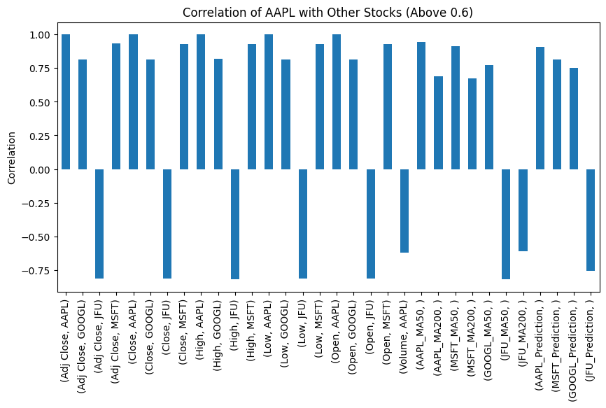

**Benchmarking performance agaisnt S&P500**

``` python
# Performance Measurement against S&P 500 Index
benchmark_data = yf.download('SPY','2020-01-01','2023-09-01')['Close']
for symbol in symbols:
   correlation_with_benchmark = data['Close'][symbol].corr(benchmark_data)
   print(symbol + " Correlation with S&P 500: ", correlation_with_benchmark)
```

    
[*********************100%%**********************]  1 of 1 completed
    AAPL Correlation with S&P 500:  0.8900998247068898
    MSFT Correlation with S&P 500:  0.9329114322662561
    GOOGL Correlation with S&P 500:  0.95062462020499
    META Correlation with S&P 500:  0.44587757367253394
    JFU Correlation with S&P 500:  -0.6723668544261696

``` python
# Performance measurement
benchmark_corr = [data['Close'][symbol].corr(benchmark_data) for symbol in symbols]
plt.figure(figsize=(10, 5))
plt.bar(symbols, benchmark_corr)
plt.title('Correlation with S&P 500')
plt.xlabel('Stock Symbol')
plt.ylabel('Correlation')
plt.show()
```
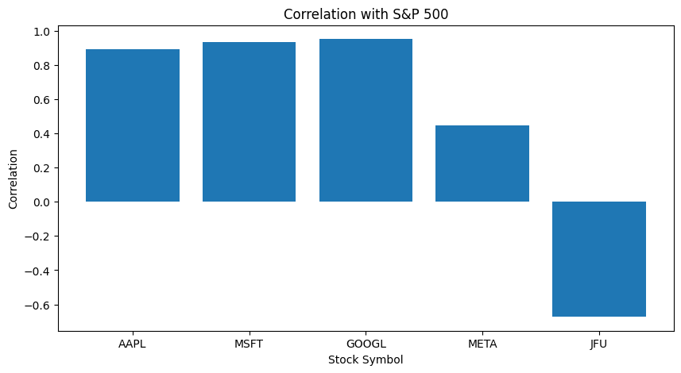

**Risk Analysis**

``` python
# Risk Analysis
for symbol in symbols:
   daily_returns = data['Close'][symbol].pct_change().dropna()
   risk_measure_std_deviation = daily_returns.std()
   print(symbol + " Risk Measure (Standard Deviation of Daily Returns): ", risk_measure_std_deviation)
```


  AAPL Risk Measure (Standard Deviation of Daily Returns):  0.021819554790903452
  MSFT Risk Measure (Standard Deviation of Daily Returns):  0.021118552747592577
  GOOGL Risk Measure (Standard Deviation of Daily Returns):  0.021448103080327605
  META Risk Measure (Standard Deviation of Daily Returns):  0.030356263394661093
  JFU Risk Measure (Standard Deviation of Daily Returns):  0.07520947731438413

``` python
# Risk measurement
risk_measure_std_deviation = [data['Close'][symbol].pct_change().dropna().std() for symbol in symbols]
plt.figure(figsize=(10, 5))
plt.bar(symbols, risk_measure_std_deviation)
plt.title('Risk Measure (Standard Deviation of Daily Returns)')
plt.xlabel('Stock Symbol')
plt.ylabel('Standard Deviation')
plt.show()
```
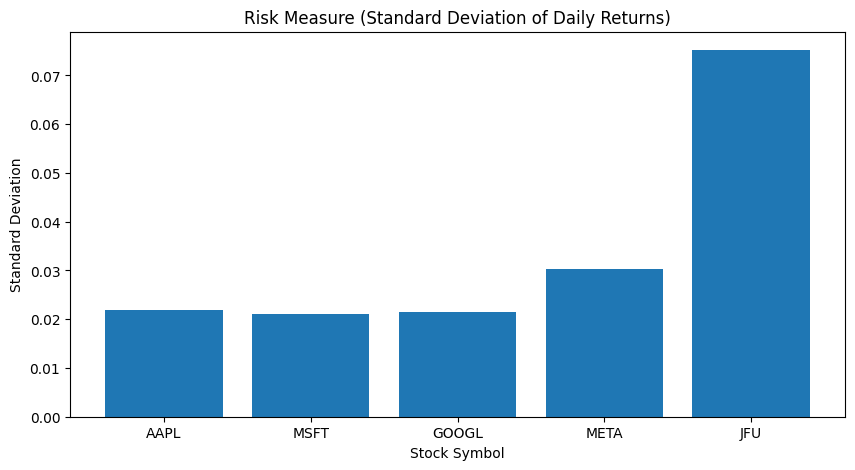


**Volatility measure (need to update metrics)**

``` python
# Calculate daily returns and volatility for each stock symbol
for symbol in symbols:
    # Calculate daily returns
    data[symbol, 'Return'] = data['Close'][symbol].pct_change()

    # Calculate volatility as the standard deviation of returns
    volatility = np.std(data[symbol, 'Return'])

    # Assess volatility
    if volatility < 0.01:
        print(symbol + " is not volatile.")
    elif volatility < 0.02:
        print(symbol + " is moderately volatile.")
    else:
        print(symbol + " is very volatile.")
```
  AAPL is very volatile.
  MSFT is very volatile.
  GOOGL is very volatile.
  META is very volatile.
  JFU is very volatile.

**Summary and data visualization**

``` python
# Summary statistics
for symbol in symbols:
    print(data[symbol].describe())
```

::: 
               Return
    count  922.000000
    mean     0.001233
    std      0.021820
    min     -0.128647
    25%     -0.009473
    50%      0.000776
    75%      0.013371
    max      0.119808
               Return
    count  922.000000
    mean     0.000997
    std      0.021119
    min     -0.147390
    25%     -0.009659
    50%      0.000642
    75%      0.012283
    max      0.142169
               Return
    count  922.000000
    mean     0.000976
    std      0.021448
    min     -0.116341
    25%     -0.009595
    50%      0.001072
    75%      0.012120
    max      0.092412
               Return
    count  922.000000
    mean     0.000843
    std      0.030356
    min     -0.263901
    25%     -0.012657
    50%      0.000683
    75%      0.015070
    max      0.232824
               Return
    count  922.000000
    mean    -0.001938
    std      0.075209
    min     -0.338109
    25%     -0.038044
    50%     -0.004408
    75%      0.025286
    max      0.836842

``` python
# Plot closing prices over time
for symbol in symbols:
    plt.figure(figsize=(10, 5))
    plt.plot(data['Close'][symbol])
    plt.title(symbol + ' Closing Prices')
    plt.show()
```
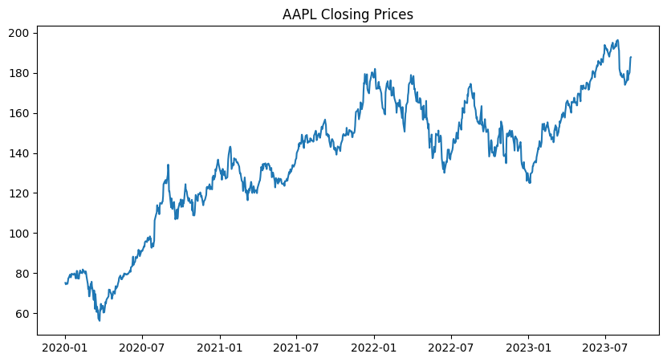
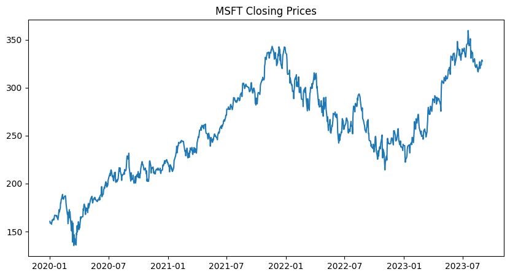
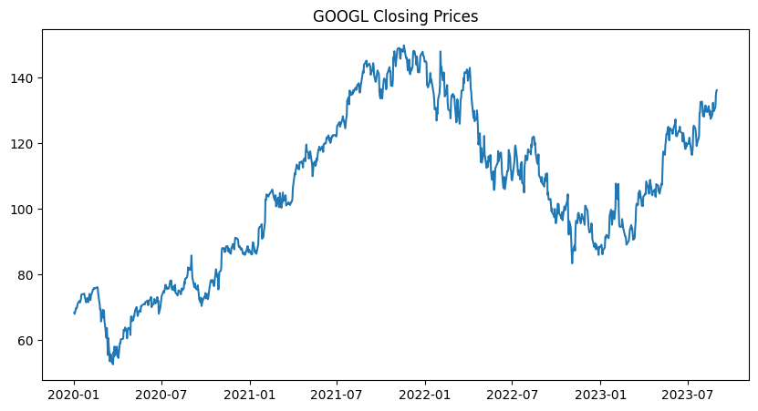
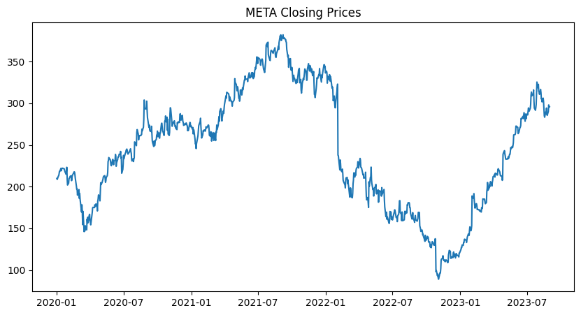
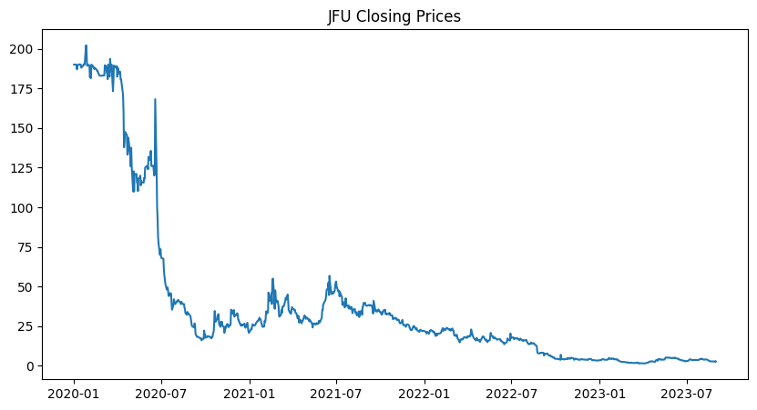

``` python
# Plot moving averages and RSI over time
for symbol in symbols:
    plt.figure(figsize=(10, 5))
    plt.plot(data[symbol+'_MA50'], label='50-day MA')
    plt.plot(data[symbol+'_MA200'], label='200-day MA')
    plt.title(symbol + ' Moving Averages')
    plt.legend()
    plt.show()

    plt.figure(figsize=(10, 5))
    plt.plot(data[symbol+'_RSI'])
    plt.title(symbol + ' RSI')
    plt.show()
```
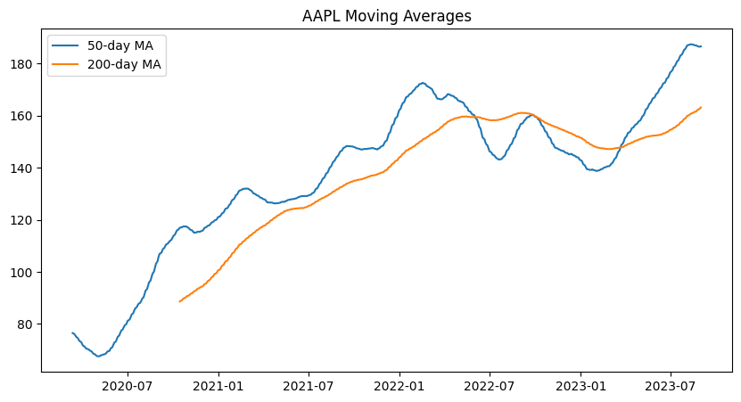
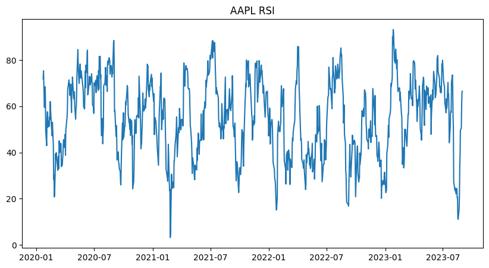
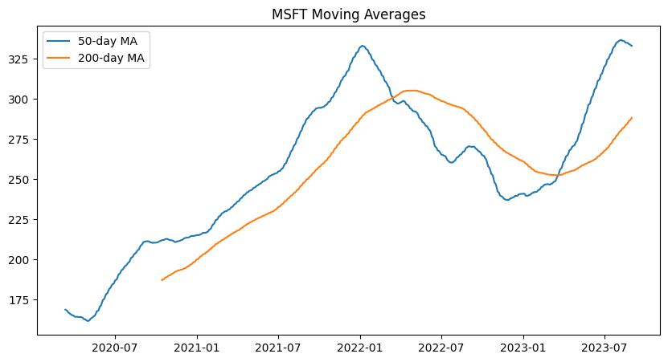
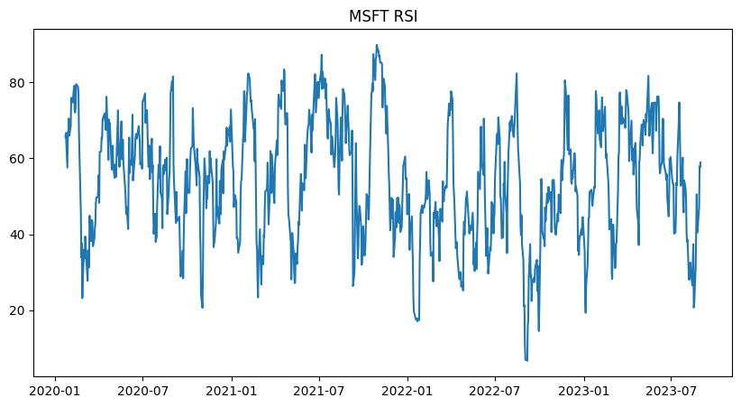
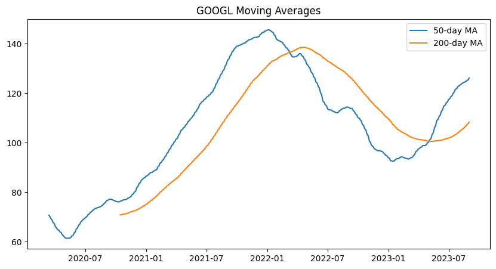
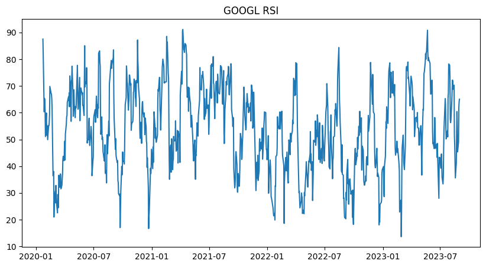
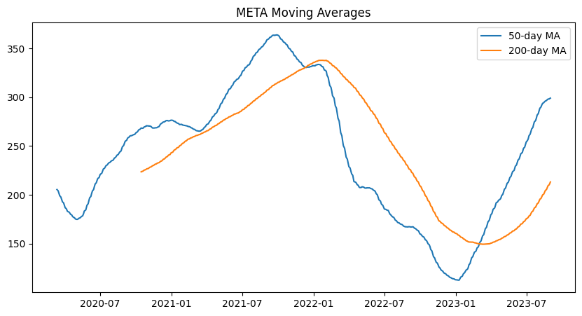
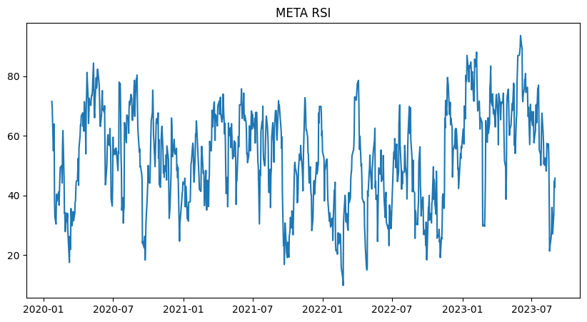
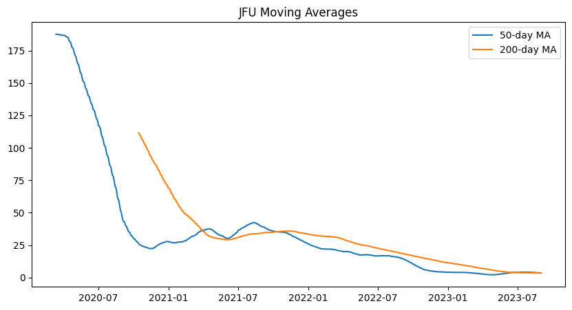
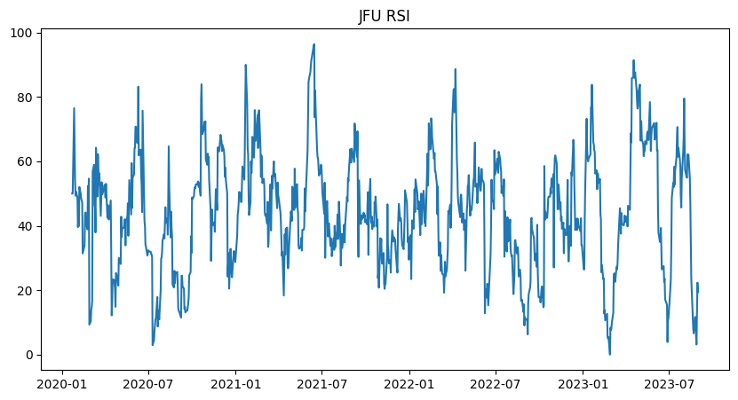


``` python
# Compare actual vs predicted prices
for symbol in symbols:
    lr_pred = lr.predict(x_test_pca)
    tree_pred = tree.predict(x_test_pca)
    forest_pred = forest.predict(x_test_pca)

    plt.figure(figsize=(10, 5))
    plt.plot(y_test, label='Actual')
    plt.plot(lr_pred, label='LR Predicted')
    plt.plot(tree_pred, label='Tree Predicted')
    plt.plot(forest_pred, label='Forest Predicted')
    plt.title(symbol + ' Stock Price Prediction')
    plt.legend()
    plt.show()
```


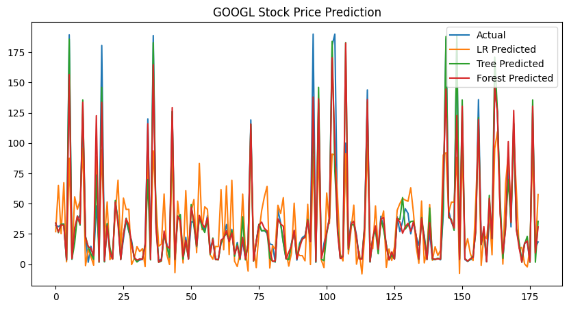
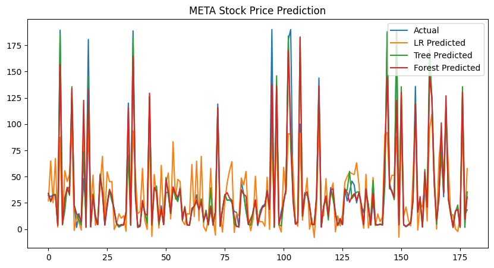

